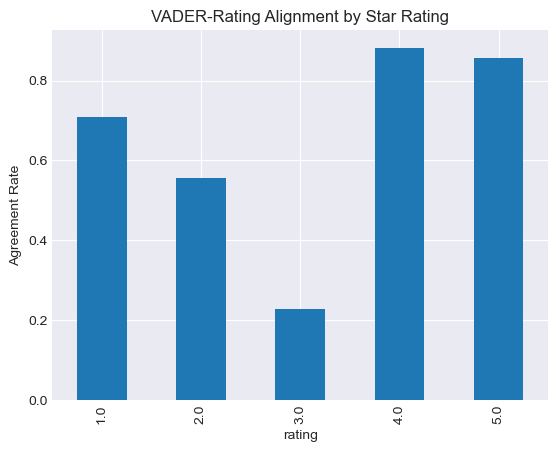

# 🇰🇪 Kenya E-commerce Reviews: Reviews vs Reality


### 🔍 Investigating customer sentiment to expose the gap between ratings and real experience on Jumia Kenya

## 📖 Overview

In this project, I set out to analyze customer reviews from Jumia Kenya using Natural Language Processing (NLP). My original goal was to detect possible manipulation in product ratings, such as fake reviews, and uncover whether sellers were benefiting from inflated visibility at the expense of honest vendors.

While the analysis revealed that the majority of reviews were verified and positive, the deeper insights came from mismatches between what customers rated and what they actually said. This project offers a practical way to understand product satisfaction, trustworthiness, and seller credibility on Kenyan e-commerce platforms.

---

## 🎯 Objectives

- Scrape real customer reviews from Jumia Kenya
- Clean and prepare the dataset for analysis
- Use TextBlob and VADER to perform sentiment analysis on review text
- Compare star ratings to text-based sentiment labels
- Visualize trends across product categories
- Identify mismatches between numerical ratings and review tone
- Build interactive dashboards in Power BI for deeper exploration

---

## 🛠 Tools & Technologies

- *Python*: Data collection, cleaning, sentiment analysis, and EDA  
- *BeautifulSoup & Requests*: Web scraping  
- *Pandas & Matplotlib*: Data manipulation and visualization  
- *TextBlob & VADER*: Sentiment polarity scoring
- *Power BI*: Dashboard development  
- *Jupyter Notebook*: Documentation and storytelling  

---

## 🧪 Key Insights

- 🤖 All reviews were from *verified purchases*, boosting credibility
- 📉 Some reviews showed mismatches — products with high ratings but negative review text, and vice versa
- 🎯 Most mismatches were subtle: e.g. “It’s okay” given a 5-star rating
- 📊 Fashion and appliance categories were the most reviewed

---

## Conclusion



- 1-star, 2-star, 4-star, and 5-star reviews have strong alignment between the written sentiment and the given rating. This means that when customers feel strongly, positively or negatively, their written reviews clearly support the rating they choose.

- However, 3-star reviews show very low alignment, indicating that customers often use the 3-star rating for mixed or uncertain experiences that are harder to capture with sentiment analysis. The written text may contain both positive and negative elements, making the sentiment appear neutral even when the rating doesn’t perfectly match.

Overall, this analysis suggests that star ratings are largely reliable, especially at the extremes. Customers who feel very satisfied or very dissatisfied tend to express that emotion both in their rating and in their review text. The only area of uncertainty is 3-star reviews, which appear to be less predictable and may not reliably represent a clear sentiment.


## 📁 Project Structure

```bash
Kenya-Ecommerce-Reviews/
│
├── Data/
│   └── cleanedData/ and Raw/
│
├── Notebooks/
│   └── analysis.ipynb
│
├── Scraper/
│   └── jumia_scraper.py and Scraping_setup.ipynb
│
├── Dashboard/
│   └── Kenya_Ecommerce_Reviews_Dashboard.pbix
│
├── Presentation/
│   └── ecommerce_insights_deck.pptx
│
└── README.md

---

## Author

**By Vanessa Sandra Assesa**